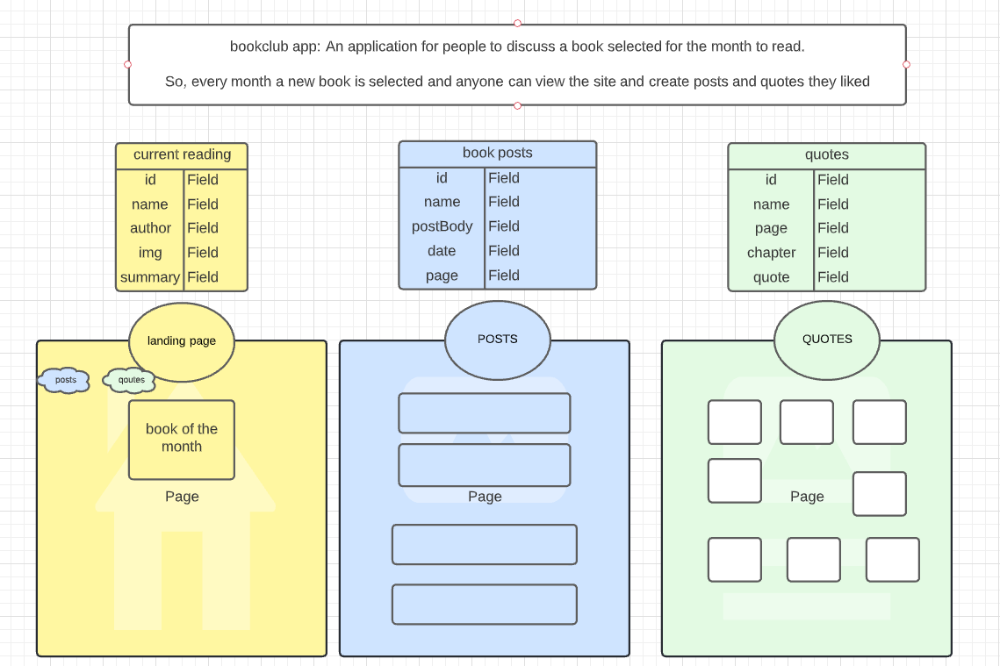
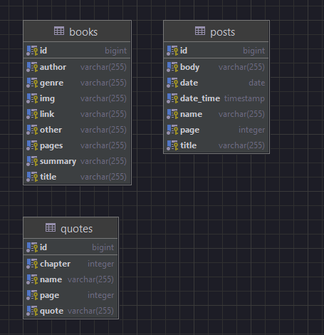
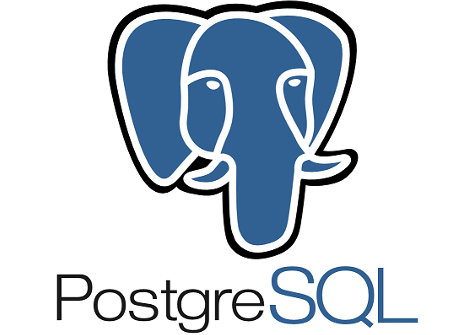
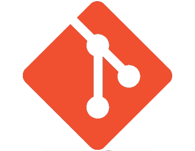

# Backend Capstone Project for Book Club application

<p>I enjoy reading 📖 and discussing with others book related topics. With the pandemic I though maybe this application can be for other introverts as well who also enjoy reading with a cup of coffee ☕ and posting book quotes and reviews. This repo contains the backend Java Springboot backend API that communicates with the <a href="https://github.com/yaretzyc/frontend-capstoneproject" target="_blank">Frontend Angular application</a>.</p>


#### CONTENTS
- [User Stories](#USER-STORIES)
- [Entity Relationship Diagrama](#ENTITY-RELATIONSHIP-DIAGRAMA-(ERD))
- [Dependencies](#DEPENDENCIES-POM.XML)
- [Endpoints](#ENDPOINTS)
- [Technologies](#TECHNOLOGIES)
- [Installation](#INSTALLATION)
- [Project Challenges](#CHALLENGES)
- [Future Improvements](#FUTURE-IMPROVEMENTS)


## USER STORIES
| | 
|:---|
|1.	As a user, I would like to create a post.
|2.	As a user, I would like to add a date to the post.
|3.	As a user, I would like to know which page the post relates to.
|4.	As a user, I would like to create a quote.
|5.	As a user, I would like to add the page number of the quote.
|6.	As a user, I would like to add the chapter to the the quote.
|7.	As a user, I would like to view the book of the month.
|8. As a user, I would like to view the title of the book.
|9. As a user, I would like to view an image of the book.
|10. As a user, I would like to view the summary of the book.
|11. As a user, I would like to view the author of the book.

## ENTITY RELATIONSHIP DIAGRAMA (ERD)
### LUCIDCHART
<p align="center">
   
### Visual Diagram (Intellij Idea)
<p align="center">


## DEPENDENCIES POM.XML
   ```
      <dependencies>
        <dependency>
            <groupId>org.springframework.boot</groupId>
            <artifactId>spring-boot-starter</artifactId>
        </dependency>

        <dependency>
            <groupId>org.springframework.boot</groupId>
            <artifactId>spring-boot-devtools</artifactId>
            <scope>runtime</scope>
            <optional>true</optional>
        </dependency>
        <dependency>
            <groupId>org.springframework.boot</groupId>
            <artifactId>spring-boot-starter-test</artifactId>
            <scope>test</scope>
        </dependency>

<!--        adding dependencies -->
        <dependency>
            <groupId>org.springframework.boot</groupId>
            <artifactId>spring-boot-starter-data-jpa</artifactId>
        </dependency>

        <dependency>
            <groupId>org.postgresql</groupId>
            <artifactId>postgresql</artifactId>
            <scope>runtime</scope>
        </dependency>

        <dependency>
            <groupId>org.springframework.boot</groupId>
            <artifactId>spring-boot-starter-web</artifactId>
        </dependency>


    </dependencies>
   ```

## ENDPOINTS
   | Request Type | Enpoint | Functionality |
|--|--|--|
|BOOK TABLE|
| 1. POST | api/book/ | create a new book |
|2. GET | api/book/books/ | get ALL books |
|3. GET | api/book/{bookId}/ | get one book |
|4. PUT | api/book/{bookId}/ | update one book |
|5. DELETE | api/book/{bookId}/ | delete one book |
|POSTS TABLE|
|6. POST | api/post/ | create one post |
|7. GET | api/post/posts/ | get all posts |
|8. GET | api/post/{postId}/ | get one post |
|9. PUT | api/post/{postId}/ | update one post |
|10. DELETE | api/post/{postId}/ | delete a post |
|QUOTES TABLE|
|11. POST | api/quote/ | create a quote |
|12. GET | api/quote/quotes/ | get all quotes |
|13. GET | api/quote/{quoteId}/ | get one quote |
|14. DELETE | api/quote/{quoteId}/ | delete a post |
|15. PUT | api/quote/{quoteId}/ | update one post|
## TECHNOLOGIES 
   POSTMAN, JAVA ULTIMATE, POSTGRES DATABASE, GIT, JAVA SPRING BOOT, lucidCharo for erd diagram

|Name      |           | Purpose     |
| -------- | -------------- |--------------|
| Postman |  <p align="center"> </p> | Build API Requests
| Intellij Idea 2021.3.1 |   <p align="center">| Code Editor for Java Spring Boot Project
| PostgreSQL Database | <p align="center"> | Database Mangement system
| GIT | <p align="center">| Version Control System
| Java Spring Boot | <p align="center">| Develop the project's web application using Spring Frameworks
| Lucidchart |  <p align="center"> | Create the Entity Relationship Diagram
   
   

## INSTALLATION

## CHALLENGES

## FUTURE IMPROVEMENTS
